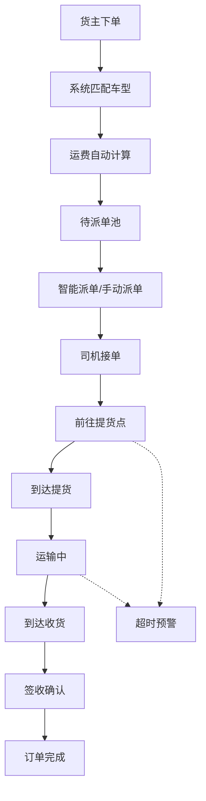
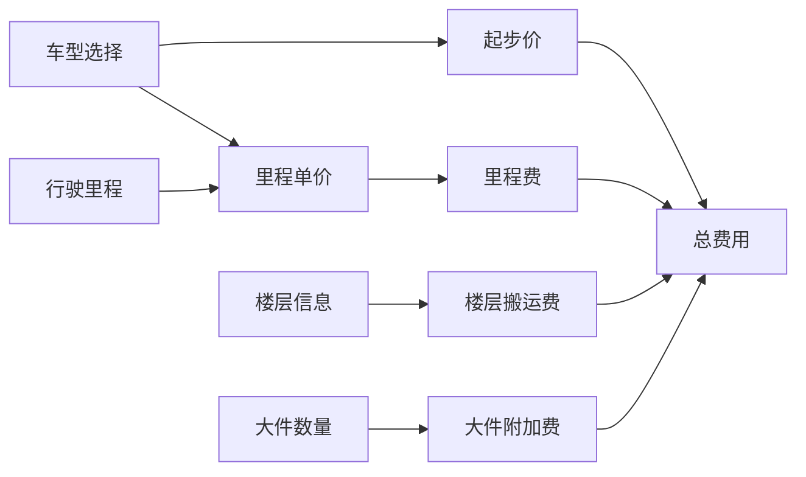

## 1. 产品概述

同城货运与小搬家管理系统是一款面向城市内货物运输和小型搬家服务的综合管理平台。系统整合订单接单、司机派单、车型智能匹配、运费自动计算、实时位置追踪、签收确认等核心功能，为货主、司机和平台运营方提供高效、透明、便捷的货运服务体验。

- 解决传统货运行业信息不对称、价格不透明、调度效率低等痛点
- 目标用户包括个人/企业货主、货运司机、平台运营管理人员

## 2. 核心功能

### 2.1 用户角色

| 角色 | 说明 | 核心权限 |
|------|------|----------|
| 货主 | 发布货运需求的用户 | 下单、查看订单、追踪位置、确认签收 |
| 司机 | 承接订单的货运司机 | 接单、查看订单、更新状态、位置上报 |
| 调度员 | 平台运营管理人员 | 订单管理、司机管理、派单调度、数据统计 |

### 2.2 功能模块

1. **订单管理**：订单创建、订单列表、订单详情、订单状态流转
2. **司机派单**：司机列表、智能派单、手动派单、接单状态
3. **车型匹配**：面包车、小厢货、4.2米厢货、6.8米厢货智能推荐
4. **运费计算**：起步价、里程费、楼层搬运费、大件附加费自动核算
5. **实时追踪**：司机位置实时更新、行驶轨迹、预计到达时间
6. **签收确认**：货物签收、电子签名、异常上报
7. **超时预警**：预约时间超时提醒、未到达自动预警

### 2.3 页面详情

| 页面名称 | 模块名称 | 功能描述 |
|----------|----------|----------|
| 工作台仪表盘 | 数据概览 | 今日订单数、在途订单、待派单、预警订单统计卡片 |
| 订单管理 | 订单列表 | 订单筛选、搜索、状态标签、分页展示 |
| 订单创建 | 下单表单 | 起点/终点地址、货物类型、重量体积、楼层信息、预约时间 |
| 订单详情 | 详情面板 | 订单信息、费用明细、司机信息、追踪地图、操作记录 |
| 司机管理 | 司机列表 | 司机信息、车辆信息、在线状态、评分等级 |
| 派单中心 | 待派单列表 | 智能推荐司机、一键派单、手动指派 |
| 实时追踪 | 地图追踪 | 司机位置实时显示、行驶路线、ETA预计到达 |
| 运费计算器 | 费用估算 | 车型选择、里程输入、楼层设置、大件数量、实时报价 |

## 3. 核心流程

### 3.1 订单全生命周期流程

货主下单 → 系统自动匹配车型 → 运费计算 → 订单进入待派单池 → 调度员/系统派单 → 司机接单 → 司机前往提货点 → 到达提货点 → 装车出发 → 运输中 → 到达收货点 → 卸货签收 → 订单完成

### 3.2 运费计算流程

选择车型 → 计算起步价 → 计算里程费 → 计算楼层搬运费 → 计算大件附加费 → 合计总费用

## 4. 用户界面设计

### 4.1 设计风格

- **主色调**：深海蓝 (#165DFF) - 代表专业、可靠、信任
- **辅助色**：活力橙 (#FF7D00) - 用于强调、警示、操作按钮
- **成功色**：翡翠绿 (#00B42A) - 订单完成、签收成功
- **警告色**：暖阳橙 (#FF7D00) - 超时预警、待处理
- **危险色**：朱砂红 (#F53F3F) - 异常、取消、错误
- **中性色**：深灰 (#1D2129)、中灰 (#4E5969)、浅灰 (#C9CDD4)、极浅灰 (#F2F3F5)

- **按钮风格**：圆角矩形 (8px)，主按钮蓝色填充，次按钮描边样式
- **字体**：中文使用 PingFang SC / Microsoft YaHei，数字使用 Roboto Mono
- **布局风格**：左侧导航栏 + 顶部状态栏 + 主内容区，卡片式布局
- **图标风格**：线性图标，统一2px描边，配合品牌色系

### 4.2 页面设计概览

| 页面名称 | 模块名称 | UI元素 |
|----------|----------|--------|
| 工作台 | 数据概览卡片 | 渐变色卡片、统计数字、趋势箭头、图标装饰 |
| 工作台 | 快捷操作区 | 圆形图标按钮、快速下单入口 |
| 工作台 | 订单状态分布 | 环形进度图、状态图例 |
| 订单列表 | 筛选栏 | 下拉选择、日期范围、搜索框 |
| 订单列表 | 订单卡片 | 订单号标签、地址信息、费用金额、状态徽标 |
| 订单详情 | 信息面板 | 分段式布局、信息分组、时间轴 |
| 订单详情 | 地图区域 | 全屏地图、标记点、路线绘制 |
| 下单表单 | 表单控件 | 地址输入、车型选择器、数字步进器、时间选择器 |
| 司机列表 | 司机卡片 | 头像、姓名、车型、评分、在线状态开关 |

### 4.3 响应式

- 采用桌面端优先设计，适配 1440px / 1920px 主流分辨率
- 平板端 (≥768px) 自适应收缩，导航栏可折叠
- 移动端 (＜768px) 底部Tab导航，卡片列表单列展示
- 地图组件支持触摸手势缩放和拖拽

### 4.4 动效与交互

- 页面加载采用渐入 + 上移动画，元素依次进场
- 状态变更时有平滑过渡动画
- 实时追踪地图上司机位置有平滑移动效果
- 预警通知从右侧滑入，带轻微震动效果
- 按钮和可点击元素有悬浮态和点击态反馈
- 数字滚动动画用于统计数据展示
