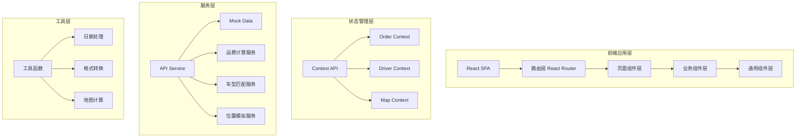
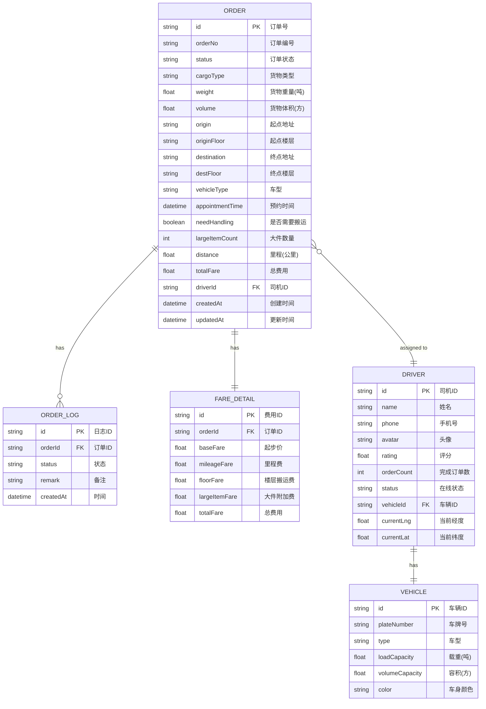

## 1. 架构设计

同城货运管理系统采用前后端分离的单页应用架构。前端使用 React + TypeScript + Vite 构建，UI 框架采用 Tailwind CSS，数据使用 Mock 数据模拟，状态管理采用 React Context + useReducer。



## 2. 技术描述

- **前端框架**: React 18 + TypeScript
- **构建工具**: Vite 5
- **样式方案**: Tailwind CSS 3
- **路由管理**: React Router v6
- **图标库**: Lucide React
- **状态管理**: React Context + useReducer
- **地图服务**: 模拟地图 (纯前端 Canvas/SVG 实现)
- **数据**: Mock 数据模拟后端接口
- **动画**: CSS Transitions + Framer Motion (可选)

## 3. 路由定义

| 路由路径 | 页面名称 | 功能说明 |
|----------|----------|----------|
| /dashboard | 工作台仪表盘 | 数据概览、快捷操作、订单统计 |
| /orders | 订单列表 | 订单查询、筛选、状态管理 |
| /orders/new | 创建订单 | 下单表单、运费预估、车型选择 |
| /orders/:id | 订单详情 | 订单信息、费用明细、实时追踪、签收 |
| /drivers | 司机管理 | 司机列表、车辆信息、在线状态 |
| /dispatch | 派单中心 | 待派单列表、智能推荐、手动派单 |
| /tracking | 实时追踪 | 地图视图、多订单追踪、位置监控 |
| /calculator | 运费计算器 | 费用估算工具 |

## 4. 数据模型

### 4.1 数据模型定义



### 4.2 订单状态枚举

| 状态值 | 状态名称 | 说明 |
|--------|----------|------|
| pending | 待派单 | 订单已创建，等待派单 |
| assigned | 已派单 | 已指派司机，等待司机接单 |
| accepted | 已接单 | 司机已接单，前往提货点 |
| arrived_pickup | 到达提货 | 司机已到达提货点 |
| loading | 装货中 | 正在装车 |
| transporting | 运输中 | 货物运输途中 |
| arrived_delivery | 到达收货 | 司机已到达收货点 |
| unloading | 卸货中 | 正在卸货 |
| completed | 已完成 | 订单签收完成 |
| cancelled | 已取消 | 订单已取消 |

### 4.3 车型定义

| 车型 | 载重(吨) | 容积(方) | 起步价(元) | 里程单价(元/公里) | 楼层搬运费(元/层) | 大件附加费(元/件) |
|------|----------|----------|------------|-------------------|-------------------|-------------------|
| 面包车 | 0.5 | 3 | 35 | 3.5 | 10 | 20 |
| 小厢货 | 1.0 | 6 | 58 | 4.5 | 15 | 30 |
| 4.2米厢货 | 2.5 | 15 | 120 | 5.5 | 25 | 50 |
| 6.8米厢货 | 5.0 | 35 | 260 | 7.0 | 40 | 80 |

## 5. 核心服务设计

### 5.1 运费计算服务

```typescript
interface FareCalculationParams {
  vehicleType: VehicleType;
  distance: number;      // 公里
  originFloor: number;   // 起点楼层
  destFloor: number;     // 终点楼层
  needHandling: boolean; // 是否需要搬运
  largeItemCount: number; // 大件数量
}

interface FareDetail {
  baseFare: number;
  mileageFare: number;
  floorFare: number;
  largeItemFare: number;
  totalFare: number;
}
```

计算规则：
- 起步价：根据车型固定
- 里程费：(里程 - 起步里程) × 里程单价，起步里程5公里
- 楼层搬运费：需要搬运时，(起点楼层 + 终点楼层 - 2) × 楼层单价 (1楼免费)
- 大件附加费：大件数量 × 大件单价

### 5.2 车型匹配服务

根据货物参数推荐合适车型：
- 重量 ≤ 0.5吨 且 体积 ≤ 3方 → 面包车
- 重量 ≤ 1.0吨 且 体积 ≤ 6方 → 小厢货
- 重量 ≤ 2.5吨 且 体积 ≤ 15方 → 4.2米厢货
- 重量 ≤ 5.0吨 且 体积 ≤ 35方 → 6.8米厢货
- 超出上限 → 提示选择更大车型或拆分订单

### 5.3 位置模拟服务

- 模拟司机位置实时更新
- 计算预计到达时间 (ETA)
- 检测超时预警
- 生成行驶轨迹点

## 6. 项目目录结构

```
src/
├── assets/              # 静态资源
├── components/          # 通用组件
│   ├── Layout/         # 布局组件
│   ├── Card/           # 卡片组件
│   ├── Button/         # 按钮组件
│   ├── Modal/          # 弹窗组件
│   ├── StatusTag/      # 状态标签
│   └── Map/            # 地图组件
├── pages/              # 页面组件
│   ├── Dashboard/      # 工作台
│   ├── Orders/         # 订单管理
│   ├── Drivers/        # 司机管理
│   ├── Dispatch/       # 派单中心
│   ├── Tracking/       # 实时追踪
│   └── Calculator/     # 运费计算器
├── context/            # Context 状态管理
│   ├── OrderContext.tsx
│   ├── DriverContext.tsx
│   └── MapContext.tsx
├── services/           # 服务层
│   ├── orderService.ts
│   ├── driverService.ts
│   ├── fareService.ts
│   ├── vehicleService.ts
│   └── locationService.ts
├── types/              # TypeScript 类型定义
│   └── index.ts
├── utils/              # 工具函数
│   ├── date.ts
│   ├── format.ts
│   └── map.ts
├── mock/               # Mock 数据
│   ├── orders.ts
│   ├── drivers.ts
│   └── vehicles.ts
├── App.tsx
├── main.tsx
└── index.css
```
